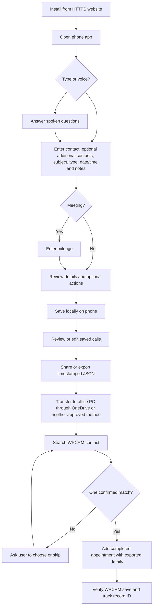

# WPCRM Call Logger workflow

The phone app records and exports calls. WPCRM entry is a separate, supervised browser workflow. No automatic CRM upload or OneDrive connection is included.

Voice: a missing response gets one retry, then stops with the form retained. Stop cancels speech/listening. Notes collect multiple final speech segments until a 3.5-second pause or a 60-second limit. Unrecognized dates require manual correction.

Backup recovery: Import JSON validates the full file, merges new record IDs, and keeps the local version of existing IDs. Importing does not change WPCRM.
